# OS Labs 使用指南

## 一、搭建开发环境

建议直接使用 `UniProton` 提供的 `docker` 镜像环境，可以避免后续使用 `CMake` 编译代码和对镜像做烧写前的签名校验时不必要的麻烦。

有关 `docker` 的安装请自行搜索相关资料。

使用如下命令拉去 `docker` 镜像:
```shell
docker pull swr.cn-north-4.myhuaweicloud.com/openeuler-embedded/uniproton:v004
```

执行完成之后，创建容器并进入（默认挂载当前执行命令的目录为容器内的/home/uniproton目录）:
```shell
docker run -it -v $(pwd):/home/uniproton swr.cn-north-4.myhuaweicloud.com/openeuler-embedded/uniproton:v004
```
至此你已经搭建好所需要的开发环境，并且与 `CMakeLists.txt` 中配置的工具链相适配。

之后每次进入 `docker` 环境无需重复创建容器的命令(否则会如字面意思一般创建很多相同的容器)，而是运行对应的容器，并使用如下命令:

```shell
> docker ps 
CONTAINER ID    IMAGE    OMMAND    CREATED    STATUS    PORTS    NAMES
Your_ID    .........

> docker exec -it Your_ID /bin/bash
```

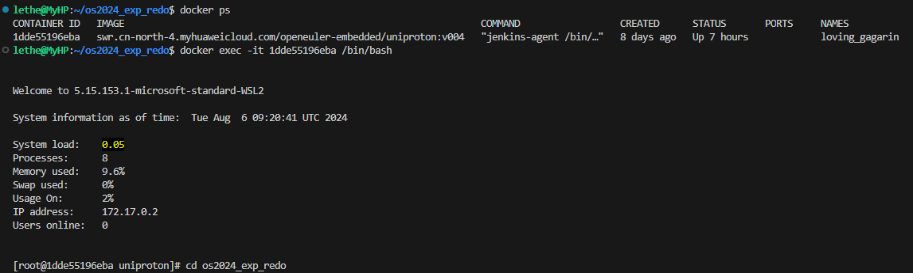

## 二、编译、签名及烧录镜像

目前只支持在 X86 架构的 Windows 系统上操作。

### 1. 编译

以在 `lab1/` 目录下为例，只需执行如下命令：
```shell
sh ./makeMiniEuler.sh
```
所生成的镜像为 `lab1/build/miniEuler.bin` 和 `lab1/build/miniEuler.elf`，后续签名和烧写我们使用 `.bin` 文件

### 2. 签名

将 `miniEuler.bin` 文件复制到 `KunPengDevBoard-SignTool/output/Image` 文件（*NB: `miniEuler.bin` 和 `Image` 是相同的文件，只是文件名不一样*）

进入 `KunPengDevBoard-SignTool/` 目录下执行以下命令完成签名(在 `docker` 镜像中执行):
```shell
sh ./sign_image.sh
```

签名后的文件依旧是 `KunPengDevBoard-SignTool/output/Image` 文件

### 3. 烧录

#### a. 烧录环境准备

需要准备 `IPOP4.1.exe` 和 `FTP Server`。关于 `FTP Server` 推荐使用 [FileZilla Server](https://www.filezilla.cn/download/server) 搭建。
需要注意以下几点：
- 确保 `FTP Server` 开启了用户 `1` 
- 确保 `FTP` 通信没有被 Windows 防火墙拦截（简单有效但不太安全的解决方案：关闭所有防火墙）
- 关于 `Authentication` 可以直接使用默认设置 `Do not require authentication`

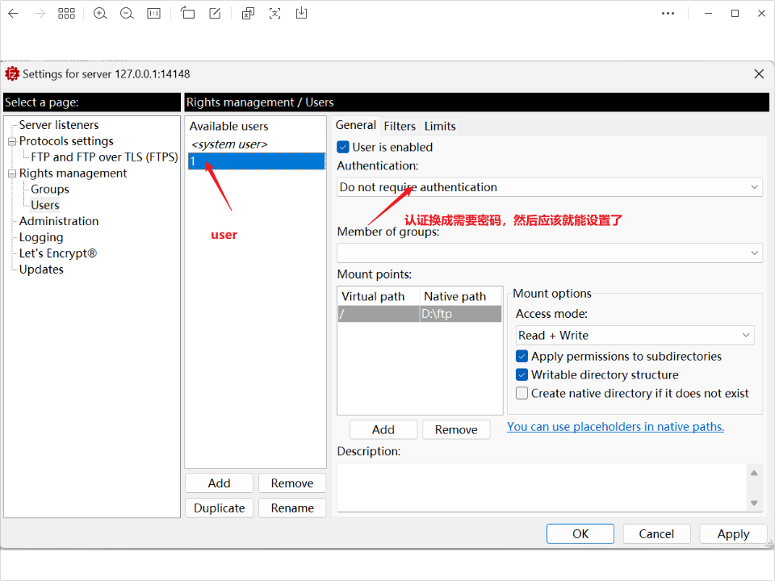

至此烧录环境搭建成功。

#### b. 硬件连线

需要连接网线、MicroUSB 调试线和电源，lab10 需要单独的 USB 转 TTL 模块来与 UART2 进行通信，引脚图如图所示：

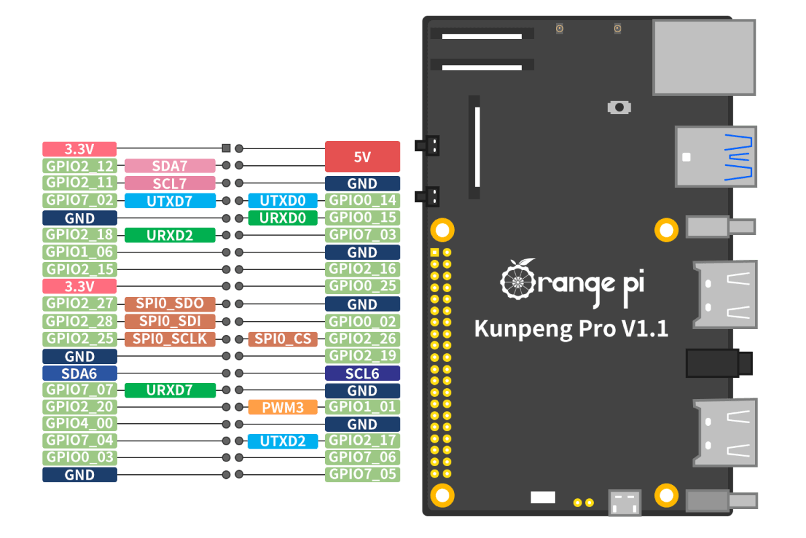

连接完网线之后将以太网配置成如下静态IP：


#### c. 烧录

打开 `IPOP4.1.exe` 连接 `COM` 端口：

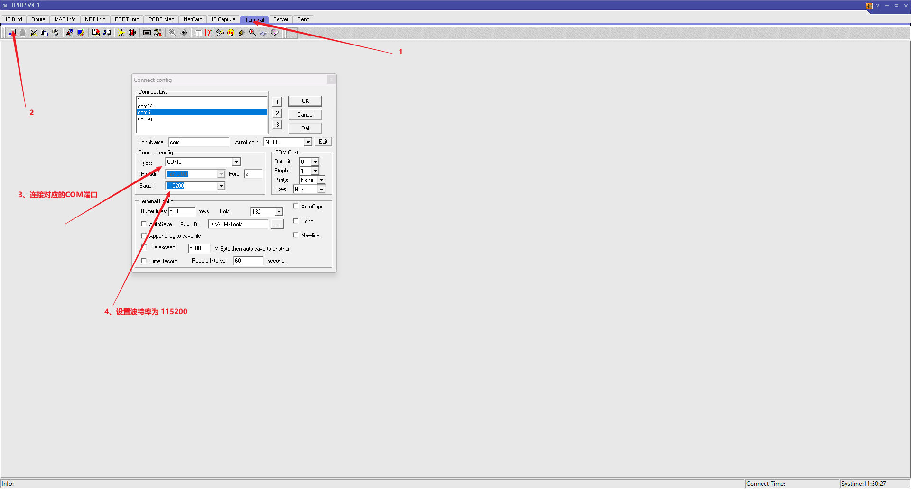

给开发板上电，并在 `IPOP` 中不断按 `delete` 建，直至进入BIOS，如图为成功界面：

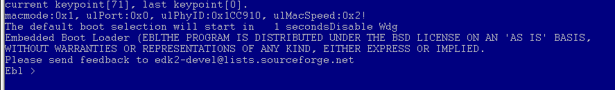


依次输入如下命令:

```shell
ifconfig -s eth0 192.168.2.50 255.255.255.0 192.168.2.1 # 设置开发板的IP地址
emmc 2
provision 192.168.2.11 -u 1 -p 1 -f lab10 -a 0x28FFDF00 # 通过 FTP 下载镜像文件，lab10记得修改为对应的文件名
emmc 11 0x28FFDF00 0x1000000 0x2700000 0x0
```

结果如图所示：

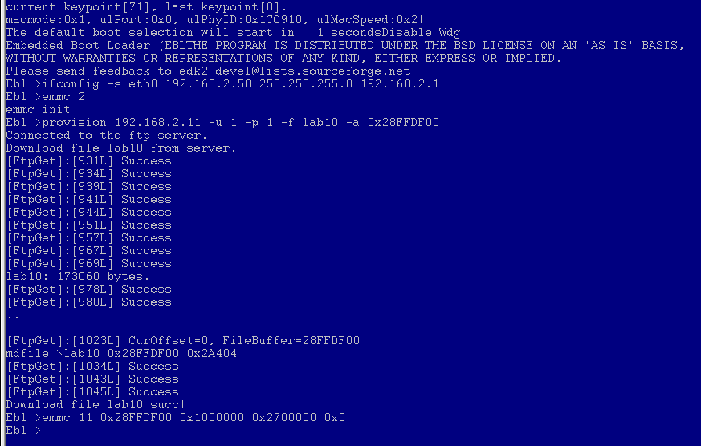

重新上电即可运行烧录的镜像。

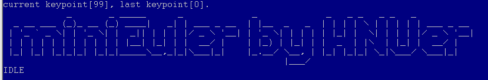

## 三、各个实验结果

各个实验的镜像在 `release/` 目录下。

### lab 1


### lab 2

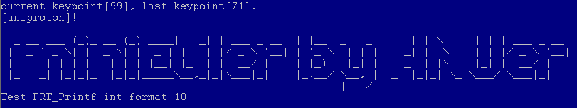

### lab 4

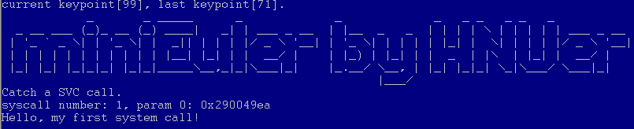

### lab 5

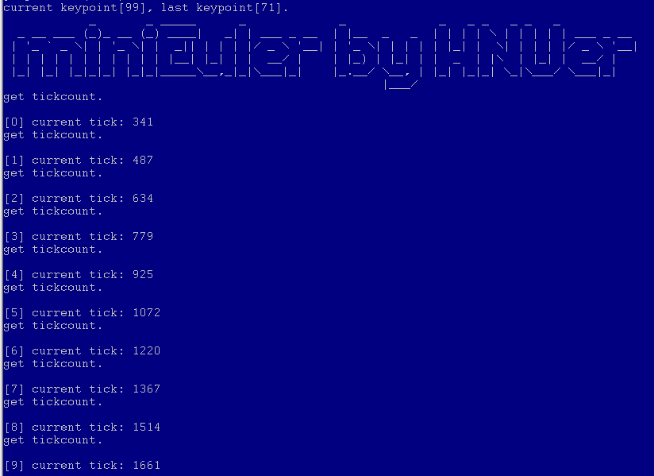

### lab 6

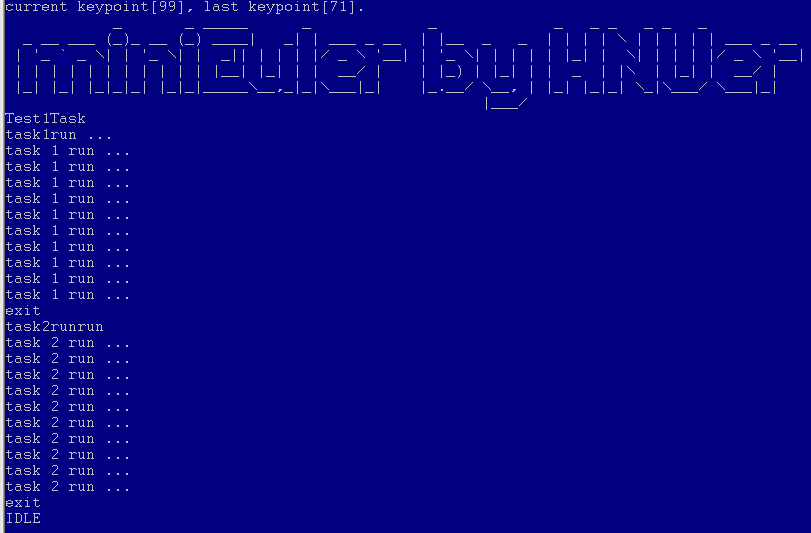

### lab 7

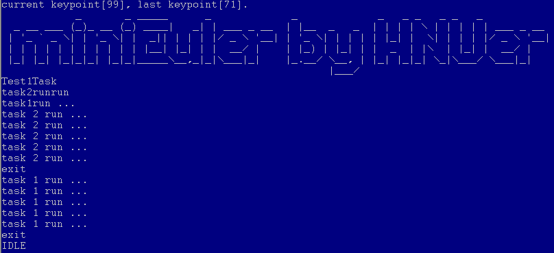

### lab 8

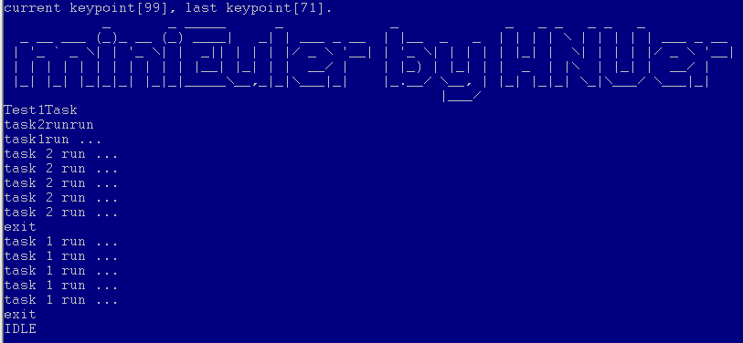

### lab 10

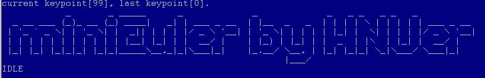

Shell 界面：

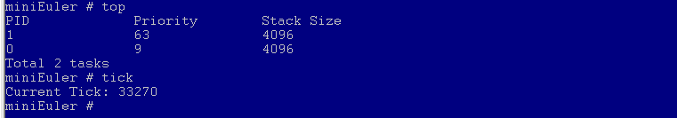